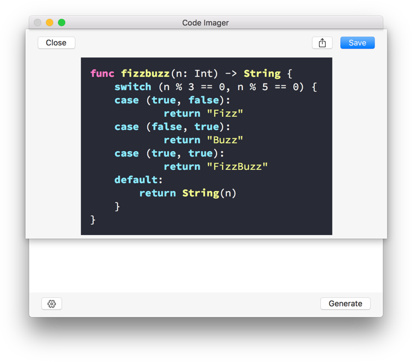
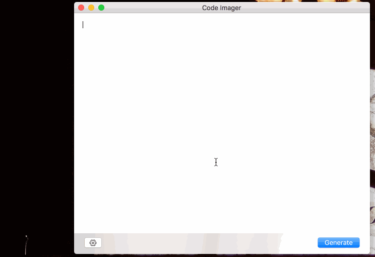

# CodeImager

This repo is used to host the releases for http://codeimager.com/:

- Release are [here](https://github.com/oarrabi/CodeImager/releases)
- Issues, features requests and roadmap is [here](https://github.com/oarrabi/CodeImager/issues)

Created by:
- Omar Abdelhafith [@ifnottrue](https://twitter.com/ifnottrue)
- Daniel Beere [@danielbeere](https://twitter.com/danielbeere)
- Giacomo Rebonato [@giacomorebonato](https://twitter.com/giacomorebonato)

Please feel free to submit issues and requests to [here](https://github.com/oarrabi/CodeImager/releases)

## Screenshot

